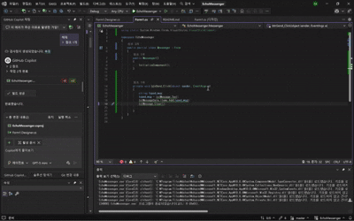
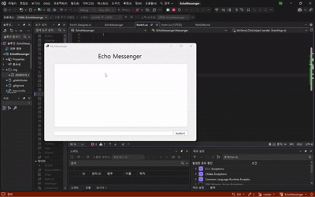
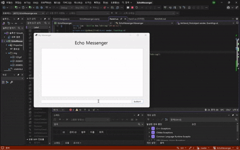
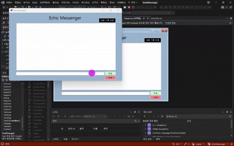

# (C# 코딩) 에코 메신저
## 개요
- C# 프로그래밍 학습
- 1줄 소개:사용자의 키보드로 입력받은 메세지를 메신저 형식으로 처리하는 앱
- 사용한 플랫폼: C#, .NET Windows Forms, Visual Studio, GitHub
- 사용한 컨트롤:
- Label, TextBox, ListBox, Button
- 사용한 기술과 구현한 기능:
- Visual Studio를 이용하여 UI를 디자인하였다.
- typed_msg라는 스트링 변수를 텍스트 박스에서 입력받아 Add()메서드로 리스트 박스에 추가하였다.
- clear()메서드를 이용하여 리스트 박스에 복사된 내용을 텍스트 박스에서 지우도록 구현하였다.
- focus()메서드를 이용하여 전송 후에 커서가 자동으로 입력창에 위치하도록 구현하였다.
- KeyDown 이벤트 핸들러를 이용하여 엔터키로도 전송이 되도록 구현하였다.
- if문을 이용하여 공백문자만 입력된 경우 전송되지 않도록 구현하였다.
- DateTime.Now.ToString("[HH:mm:ss]")를 이용하여 타임스탬프 기능을 구현하였다.
- lstMessageData.Items.Count 속성을 이용하여 메세지 개수 카운팅 기능을 구현하였다.
- Trim()메서드를 이용하여 입력된 메세지의 앞뒤 공백 제거 기능을 구현하였다.
- RemoveAt()메서드를 이용하여 선택된 메세지 삭제 기능을 구현하였다.
- Clear()메서드를 이용하여 대화 기록 삭제 기능을 구현하였다.
- TextChanged 이벤트 핸들러를 이용하여 입력창 글자 수 제한 기능을 구현하였다.

## 실행 화면 (과제1)
- 과제1 코드의 실행 스크린샷

- 과제 내용
- Label(표시), TextBox(입력), Button(전송), ListBox(대화창)를 적절히 배치합니다.
- - 전송 버튼 클릭 시 TextBox의 텍스트를 ListBox의 항목(Items)으로 추가합니다.
- 추가 직후 TextBox의 내용을 비워(Clear) 다음 입력을 준비합니다.

- 구현 내용과 기능 설명
- 입력창에 메세지를 입력하고 전송 버튼을 클릭하면 Add() 메서드를 통해 typed_msg변수에 저장된 메세지가 대화창에 추가되고 Clear()메서드로 입력창이 비워지도록 구현하였다.

## 실행 화면 (과제2)
- 과제2 코드의 실행 스크린샷

- 과제 내용
- 전송 후에 마우스로 입력창을 다시 클릭하지 않아도 되도록 커서를 자동으로 입력창에둡니다.
- 마우스 클릭 대신 키보드의 Enter 키를 눌러도 메시지가 전송되도록 합니다.
- 내용이 없는 빈 문자열이나 공백(Space)만 있을 때는 메시지가 전송되지 않도록 방지합니다

- 구현 내용과 기능 설명
- 문자를 입력하고 전송을 하면 focus()메서드를 통해 커서가 자동으로 입력창에 위치하도록 구현하였다.
- 전송을 클릭하는 대신 엔터키를 눌러도 전송이 되도록 다음을 통해 구현하였다.
private void txtMessage_KeyDown(object sender, KeyEventArgs e)
        {
           
            if (e.KeyCode == Keys.Enter)
            {
                btnSend_Click(sender, e);
               
            }
- if문을 이용하여 공백문자만 입력된 경우 전송되지 않도록 구현하였다.   코드는 다음과 같다.
- if (string.IsNullOrWhiteSpace(txtMessage.Text)){ return; }

## 실행 화면 (과제3)
- 과제3 코드의 실행 스크린샷

- 과제 내용
- 메시지 앞에 현재 시간([14:20:05])을 자동으로 결합하여 리스트에 출력합니다.
- 현재 리스트에 쌓인 총 메시지 개수를 계산하여 하단 Label에 실시간으로 업데이트합니다.
- 사용자가 입력한 메시지의 앞뒤 불필요한 공백을 Trim() 함수로 제거하여 저장합니다.

- 구현 내용과 기능 설명
- 먼저 string time = DateTime.Now.ToString("[HH:mm:ss]");로 지역 변수를 만들어서 현재 시간을 [HH:mm:ss] 형식으로 저장하였다.
  그 후 기존의 lstMessageData.Items.Add(typed_msg);  코드에 time과 공백 문자열을 더하는 식으로 타임스탬프를 구현하였고 마지막에 Trim()메서드를 이용하여 앞뒤 공백 제거 기능도 구현하였다.
  코드는 다음과 같다 lstMessageData.Items.Add(time + " " + typed_msg.Trim());
- 메세지 개수 카운팅 기능은 lstMessageData.Items.Count 속성을 이용하여 lblMessageCount.Text = "현재 대화: " + lstMessageData.Items.Count.ToString() + "개"; 로 구현하였다.
 이 기능을 구현하는 도중 계속하여 오류가 나서 알아보니 lstMessageData.Items.Count는 int형이여서 문자열과 더할 수 없기 때문에 나오는 오류였다.
 그래서 ToString()메서드를 이용하여 int형을 문자열로 변환하여 해결하였다.

 ## 실행 화면 (과제4)
- 과제4 코드의 실행 스크린샷

- 과제 내용
- ListBox에서 특정 메시지를 마우스로 클릭하고 '삭제' 버튼을 누르면 해당 항목만 목록에서제거합니다. (단, 선택하지 않고 삭제 시 발생하는 에러를 예외 처리해야 함)
- '대화 기록 삭제' 버튼을 클릭하면 리스트의 모든 내용을 한 번에 지웁니다.
- 입력창에 글자 수를 50자로 제한하고, 초과시 사용자에게 경고 메시지를 띄우거나 전송을차단합니다.

- 구현 내용과 기능 설명
- 선택 메세지 삭제 기능을 구현할 때 RemoveAt()메서드를 이용하여 lstMessageData의 선택된 인덱스에 해당하는 항목을 제거하였다. 
또, 앞에서 메세지 카운팅 기능을 구현할 때 썼던 코드를 재활용하여 메세지 개수도 갱신되도록 구현하였다. 
선택하지 않을 시 발생하는 에러의 예외 처리는 선택된 인덱스가 있을 경우에 값이 0이상이라는 점을 이용하여 if문으로 구현하였다.
코드는 다음과 같다.
- if (lstMessageData.SelectedIndex != -1)
            {
                lstMessageData.Items.RemoveAt(lstMessageData.SelectedIndex);
                lblMessageCount.Text = "현재 대화: " + lstMessageData.Items.Count.ToString() + "개";
            }
            else
            {
                MessageBox.Show("삭제할 항목을 선택하세요.");
            }
- 대화 기록 삭제 기능은 Clear()메서드를 이용하여 lstMessageData의 모든 항목을 제거하도록 구현하였다. 
lblMessageCount.Text = null;코드도 같이 넣어서 메세지 개수 카운팅 기능도 초기화되도록 구현하였다.
- 입력창 글자 수 제한 기능은 먼저 TextChanged 핸들러에 if문을 이용하여 Length 속성이 50을 초과할 때 경고 메시지를 띄우도록 구현하였다.
코드는 다음과 같다.
- private void textBox1_TextChanged(object sender, EventArgs e)
        {
            if (txtMessage.Text.Length > 50) { MessageBox.Show(" 최대 글자 수는 50자 입니다."); }
        }
- 또, 버튼을 무시하고 글자를 계속 입력하는 경우를 방지하고자 전송버튼을 구현하는데 사용했던 if문에 else if문을 추가하여 글자 수가 50을 초과할 때 전송이 되지 않도록 구현하였다.
코드는 다음과 같다.
-  private void btnSend_Click(object sender, EventArgs e)
        {

            string typed_msg;
            typed_msg = txtMessage.Text;
            if (string.IsNullOrWhiteSpace(txtMessage.Text)) { return; }
            else if (txtMessage.Text.Length > 50) { MessageBox.Show("전송할 수 없습니다.");
                return;
            }// 추가된 코드

            lstMessageData.Items.Add(time + " " + typed_msg.Trim());
            lblMessageCount.Text = "현재 대화: " + lstMessageData.Items.Count.ToString() + "개";
            txtMessage.Clear();
            txtMessage.Focus();

        }